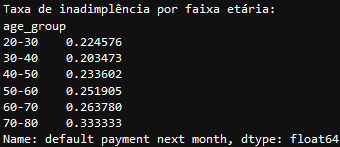
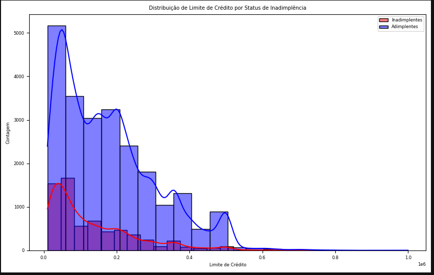
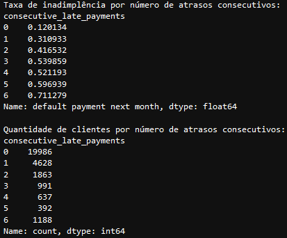
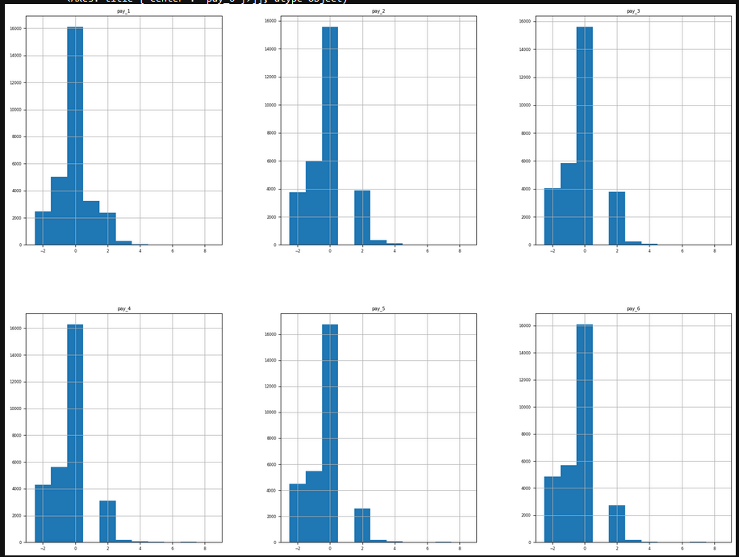
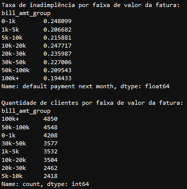
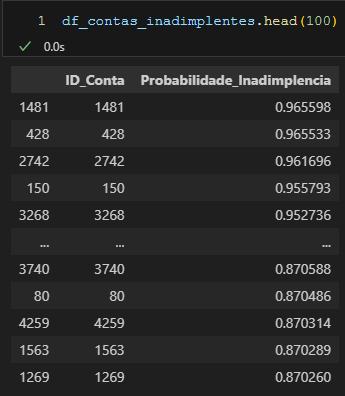

# Modelo de previsão de inadimplência de crédito

## Problema de Negócio

A empresa de financeira enfrenta o desafio de prever com precisão quais clientes provavelmente irão inadimplir no próximo mês. Isso é essencial para que ela possa tomar medidas preventivas, como oferecer aconselhamento financeiro aos clientes, evitando perdas financeiras significativas. O problema envolve o uso de dados históricos de transações e informações pessoais dos clientes para prever a inadimplência, buscando minimizar os custos relacionados a erros de previsão, tanto com inadimplentes quanto com clientes erroneamente classificados.

O objetivo deste projeto é produzir um modelo de aprendizado de máquina capaz de prever com precisão a inadimplência, otimizando os benefícios financeiros para a empresa.

## Solução Estratégica Adotada

Desenvolvemos um modelo de aprendizado de máquina para prever inadimplência com foco em maximizar a economia líquida, encontrando o melhor threshold que equilibre os custos de falsos positivos e falsos negativos.

**Etapas do projeto:**

1. **Entendimento do Negócio:** Analisar o problema de inadimplência e como ele impacta financeiramente a empresa.

2. **Problema de Negócio:** Definir o problema de maneira clara e objetiva, focando na redução do custo relacionado à inadimplência.

3. **Coleta de Dados:** Dados fornecidos pela empresa, incluindo histórico de transações de clientes e características pessoais.

4. **Análise Estatística e Limpeza dos Dados:** Limpar, tratar e transformar os dados para garantir que estejam prontos para análise e modelagem.

5. **Análise Exploratória de Dados (EDA):** Entendimento das variáveis mais relevantes, análise de correlações e criação de hipóteses.

6. **Modelagem Preditiva:** Testar diferentes modelos de machine learning, incluindo Logistic Regression, Decision Tree e Random Forest, e otimizar hiperparâmetros para melhorar o desempenho.

7. **Treinamento dos Algoritmos de Machine Learning:** Treinamento do modelo final com base nos dados processados.

8. **Ajuste de Threshold:** Encontrar o valor de threshold que maximiza a economia líquida.

9. **Avaliação do Modelo:** Medir a performance do modelo utilizando métricas como ROC AUC, Precision e Recall.

10. **Deploy e Interpretação:** Traduzir os resultados do modelo em valores de negócios, criar uma lista em CSV com as contas que possuem maior probabilidade de inadimplir no próximo mês para embasar a tomada de decisões.

## Base de Dados

O conjunto de dados utilizado foi obtido a partir de uma base interna da empresa (Kaggle.com), contendo informações sobre transações e características dos clientes, bem como o histórico de inadimplência.

## Top Data Insights

Aqui estão os principais insights gerados a partir da análise e modelagem dos dados:

1. A taxa de inadimplência aumenta com a idade, especialmente acima dos 50 anos, onde a concentração de inadimplentes é notável. Jovens ainda apresentam inadimplência, mas a proporção cresce nas faixas etárias mais altas.
   

2. Limites de crédito mais altos estão associados a uma menor probabilidade de inadimplência. Conforme o limite de crédito aumenta, a taxa de inadimplência diminui, sendo 31.99% para limites até 50k e apenas 11.96% para limites entre 400k e 500k.
   

3. A hipótese de que clientes com pagamentos atrasados consecutivos têm maior probabilidade de inadimplência foi confirmada, com inadimplência variando de 11,7% (sem atrasos) a 71,1% (seis atrasos). No entanto, inconsistências nos dados comprometem esta hipótese, especialmente com contas em atraso de 2 meses, indicam problemas na coleta e geração de relatórios, destacando a necessidade de verificar a qualidade dos dados.
   

4. Valores mais alto fatura atual não aumentam a probabilidade de inadimplência no próximo mês. As taxas de inadimplência são mais altas nas faixas de fatura menores, com a menor taxa (19.49%) observada em valores superiores a 100k, sugerindo que clientes com faturas mais altas têm maior capacidade de pagamento.
   

## Modelos de Machine Learning

Durante a modelagem, utilizamos diferentes algoritmos de machine learning, tais como:

- **Regressão Logística:** Primeiro modelo testado, servindo como baseline.

- **Decision Tree:** Modelo eficiente, mas que requer ajustes finos.

- **Random Forest:** Apresentou o melhor desempenho em termos de velocidade e precisão.

## Performance do Modelo

O modelo final, utilizando Random Forest com o threshold ajustado para 0.47, obteve uma economia líquida significativa e reduziu o número de inadimplentes com boa precisão. O desempenho foi avaliado através de várias métricas:

- **ROC AUC:** 0.77

- **Precisão (inadimplentes):** 51%

- **Recall (inadimplentes):** 58%

- **Accuracy geral:** 78%

## Impacto do Modelo no Negócio

1. **Maior economia líquida possível:** Com o modelo, a maior economia líquida alcançada foi de **NT$ 16.901.935,86**.

2. **Custo total das inadimplências:** Sem qualquer intervenção do modelo, o custo total das inadimplências seria de **NT$ 69.630.495,33**.

3. **Redução percentual da inadimplência:** O modelo ajustado com o threshold de 0.47 conseguiu reduzir a inadimplência em **24,27%**.

4. **Economia líquida por conta:** A economia líquida por cliente foi de **NT$ 2.846,88**.

5. **Curva Precision vs Recall:** O modelo apresentou precisão de 51% e recall de 58% para a classe de inadimplentes.

6. **ROC AUC no conjunto de teste:** O modelo alcançou um **ROC AUC de 0.77**, sugerindo uma capacidade preditiva razoável.

Como se pode observar, com o modelo, foi possível calcular o impacto financeiro em termos de economia líquida, e o valor estimado foi de **NT$ 16.901.935,86**, ou seja, reduzindo o custo da inadimplência em **24,27%**. Isso ajuda a empresa a tomar decisões de forma mais eficiente sobre aconselhamento e mitigação de inadimplência.

## Entrega Final (v.1) - Lista clientes com grandes probabilidades de Inadimplência
Você pode acessar o arquivo CSV com as contas inadimplentes [aqui](list_prob_default_accounts/contas_inadimplentes.csv).

## Próximos Passos

Os próximos passos para otimizar o modelo e garantir sua eficácia no longo prazo incluem:

- Implementação do modelo XGBoost para comparação.

- Monitoramento contínuo do modelo em produção.

- Ajustes periódicos no threshold e hiperparâmetros.

- Desenvolvimento de novos modelos para grupos de clientes com características diferentes.

- Reavaliação periódica das métricas de performance e adequação do modelo.

## Quem Sou

Meu nome é Emerson Carlos de Oliveira. Sou advogado, formado em Ciências de Dados pela Comunidade DS, em Analista de Dados pela Coder House e estudante de Engenharia de Software.

Email: emerson_uo@hotmail.com

LinkedIn: [Emerson Carlos de Oliveira](https://www.linkedin.com/in/emerson-carlos-oliveira/)
